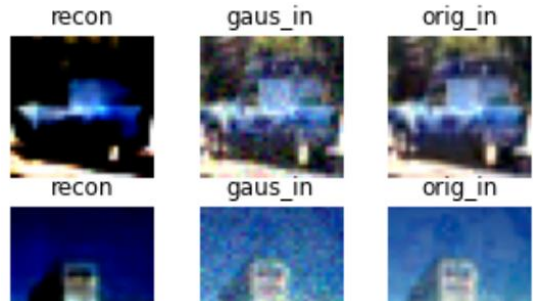
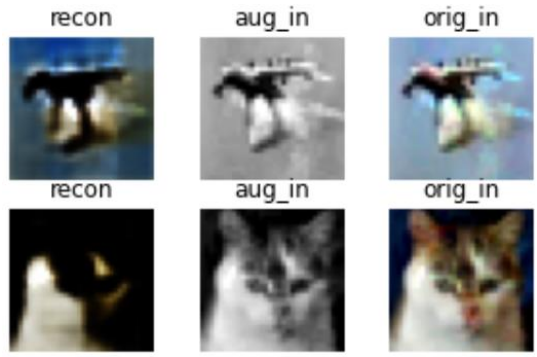
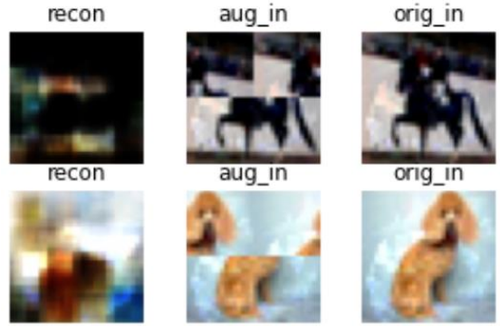
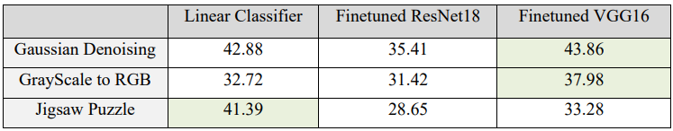
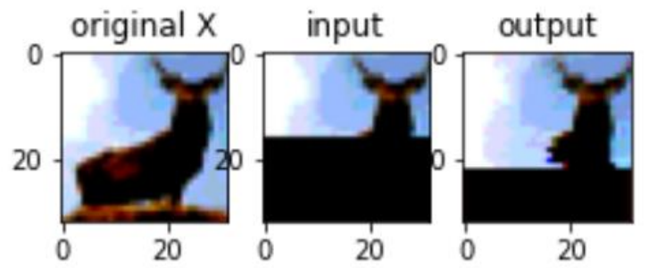
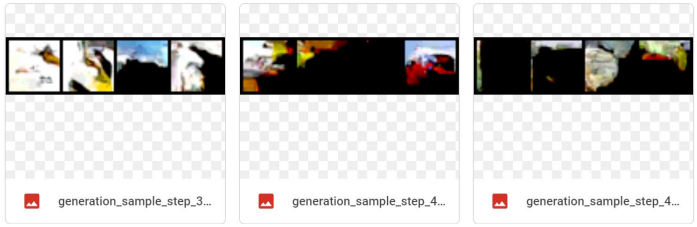
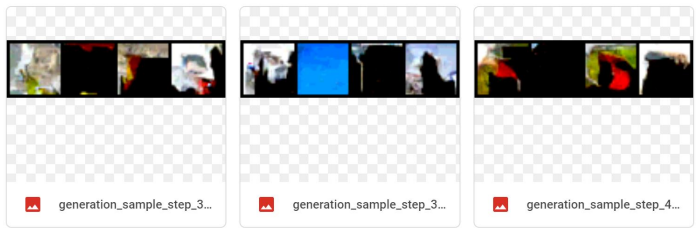
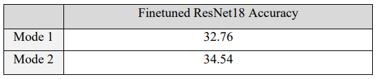

In this project, I perform downstream tasks in self-supervised learning. In the first part, I use an autoencoder as a pretext model to learn the representatations in a self-supervised fashion. In the second part I use PixelCNN auto-regressive generative model for the pretext.

# Part 1 

I trained a Convolutional Autoencoder with 3 blocks of Conv2d+MaxPool in the encoder. I used 3 different tasks to learn a representation.

- Denoising Gaussian Noise

From left to right, the reconstructed image, the augmented input image, and the original input image

- Converting Gray scale to RGB

MSE loss has a hard time with colors.

- Solving the image's JIGSAW puzzle

I made 4 patches from the images and shuffled them. The model cannot reconstruct the images, since its a shallow and simple network.
The loss I used is MSE, which is not ideal especially when dealing with colors.

### Results

For evaluation I added a linear classifier to the self-supervised learnt representation. I compared the classification downstream task performance with the performance of inputting the generated decoder image to a finetuned VGG16 and ResNet18 network.
In Gaussian and Graysale modes, Finetuned VGG has outperformed our model (Autoencoder Representation + Linear classifier)
. However in Jigsaw puzzle mode our model is better than both VGG and ResNet.

# Part 2

In this part, I used a PixelCNN auto-regressive generative model for the pretext. In the training, In the first mode, I tried give the model only the upper half of the images and to generate the full image in the output. In the second mode, I gave the model the original image, and tried to reconstruct it again.

The figure below shows the image reconstruction in the training.

The figures below shows some generated images using the created PixelCNN.

- First mode

- Second mode

The table below shows the evaluation result using PixelCNN. I took the decoder's output and passed it on finetuned ResNet18 for classification. We can see that the second mode is better:

