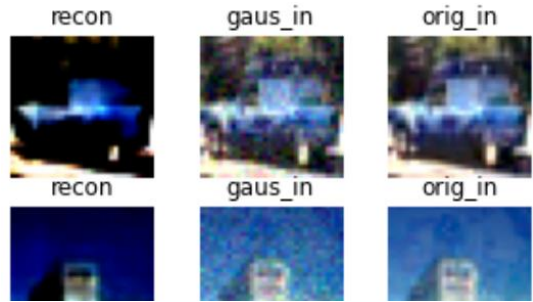
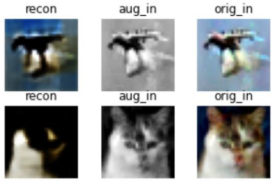
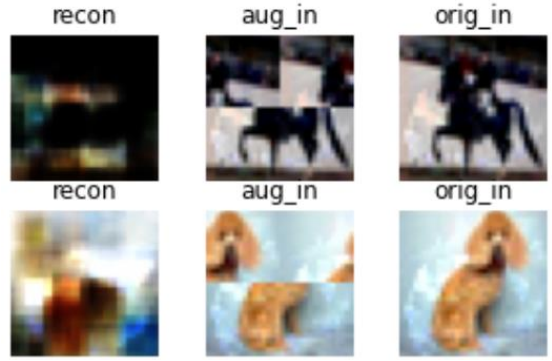
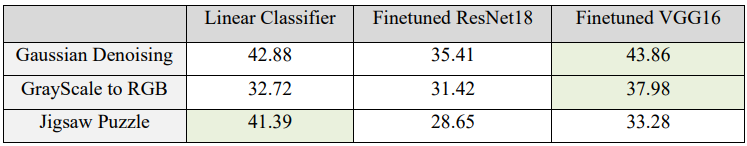

In this project, I compare performing downstream tasks by adding a linear classifier to the learnt representation with finetuned VGG16 or ResNet18 models. In the first part, I use an autoencoder as a pretext model to learn the representatations in a self-supervised fashion. In the second part I use PixelCNN auto-regressive generative model for the pretext.

# Part 1 

I trained a Convolutional Autoencoder with 3 blocks of Conv2d+MaxPool in the encoder. I used 3 different tasks to learn a representation.

- Denoising Gaussian Noise

From left to right, the reconstructed image, the augmented input image, and the original input image

- Converting Gray scale to RGB

MSE loss has a hard time with colors.

- Solving the image's JIGSAW puzzle

I made 4 patches from the images and shuffled them. The model cannot reconstruct the images, since its a shallow and simple network.
The loss I used is MSE, which is not ideal especially when dealing with colors.

### Results

For evaluation I added a linear classifier to the self-supervised learnt representation. I compared the classification downstream task performance with the performance of a finetuned VGG16 and ResNet18 network.
In Gaussian and Graysale modes, Finetuned VGG has outperformed our model (Autoencoder Representation + Linear classifier)
. However in Jigsaw puzzle mode our model is better than both VGG and ResNet.

# Part 2
