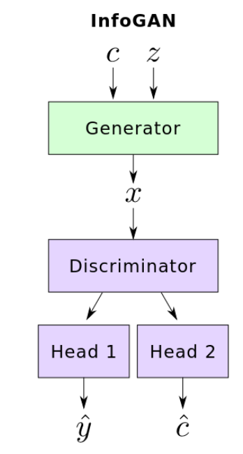
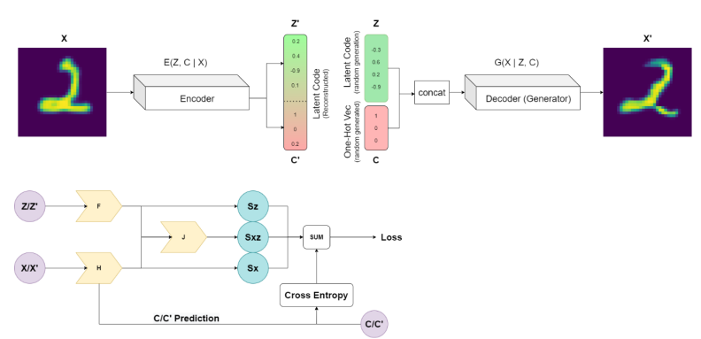
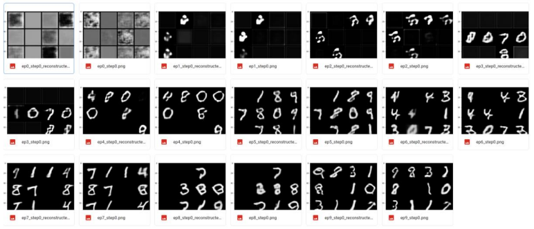

In the first part of this project, I perform an analysis on different loss components of BigBiGAN. In the second part, I encorporate the idea of InfoGAN in BigBiGAN.

----------------------------------
--------------------------------
-------------------------------

# Part 1 

In the recent years, and after introducing the first Generative Adversarial Network, there has been many attempts at making the training of generative models more stable and their outputs more realistic. However, eventhough GAN produces better looking images than VAEs, it lags behind VAE in that it cannot encode real data (This is important because even when using Generative Models, our goal is often classification)
In [BiGAN](https://arxiv.org/abs/1605.09782) paper, an extra encoder was trained alongside the generator and the discriminator to allow data encoding. However, BiGAN is an old paper, and it does not have the innovations of recent GAN works. Later, in [BigBiGAN](https://arxiv.org/abs/1907.02544) paper, the architecture of [BigGAN](https://arxiv.org/abs/1809.11096) and the idea of BiGAN were combined so the results looked great in addition to the possiblity to encode data. 

In the first part of this project, I performed an in depth analysis of the elements present in BigBiGAN's loss function (See the figure below). 

The evaluation metrics I used are:
- Linear Accuracy: KNN(n=3) prediction on the encoded representations.
- Fréchet inception distance (FID): FID score between a random batch of 256 original images and a random batch of 256 generated images.
- Inception Score: Used a inception_v3 model pretrained on Imagenet, and a batch of 256 images to derive the score. 

I used the MNIST dataset and tried turning off each of the loss elements Sx, Sz, and Sxz, hence gaining an intuition on the effect of each one in the final performance.

---------------------------------------------------------------------
### Sx off, Sz off
The learning is very unstable in this configuration. In some epochs, the generator loss would reach zero while the discriminator loss would reach around 40.

***Reconstructed images of each epoch:***

The model is producing random data throughout its learning.

***Random generated images from a batch:***

The images are at most different in a few pixels.
FID is 126.579 which is very large.
Linear Accuracy is 18.20%.

---------------------------------------------------------------------
### Sx off, Sz on
The results are a little better in this configuration. However, Sx is the most important part of the loss, and without that we are telling the model that we don't care how similar should the generated image be to the original image, and its possible that we reach a reconstructed digit that is different than the original one!

***Reconstructed images of each epoch:***

***Random generated images from a batch:***

FID is 10.53 which is very better than the last configuration but still large.
Linear Accuracy is 11.11%.

---------------------------------------------------------------------
### Sx on, Sz off

The results are again better than the last configuration. Note that in this configuration, matching the generated X with the real X is much more important than matching Z.

***Reconstructed images of each epoch:***

***Random generated images from a batch:***

FID is 0.777 which is very good.
Linear Accuracy is 12.41%.

---------------------------------------------------------------------
### Sx on, Sz on
The results are better than all the previous configuration. Here we are using all elements of the BigBiGAN loss function.

***Reconstructed images of each epoch:***

***Random generated images from a batch:***

FID is 0.3373 which is the best among all configurations.
Linear Accuracy is 15.77%.
Inception Score is 1.165.

---------------------------------------------------------------------
### Sx on, Sz on, Sxz off

In the previous configurations, Sxz was left untouched. Here I have analyzed what happens if we take out Sxz. It seems that the use of Sxz is not critical, but it affects the final performance.

***Reconstructed images of each epoch:***

***Random generated images from a batch:***

FID is 5.81.
Linear Accuracy is 10.72%.

---------------------------------------------------------------------
The table below summarizes the findings of these experiments:

### Discussion:

We can see that the FID and the quality of the reconstructed images depends on the power of the discriminator on recognizing both real Zs and Xs from the fake. It also depends on the generator and the encoder's power on creating realistic Xs and Zs. However, X is more important than Z.

We can also see that the Linear Accuracy also follows a similar rule, only except when neither Sx nor Sz is on. The reconstructed images were bad in that case and the generator's loss was 0, while the discriminator had not still converged and it could not even discriminate such bad images from the real ones. But the generated Z in that case had better patterns that caused higher linear accuracay.

I think that for Linear Accuracy I would need to train each configuration for more epochs to reach better and more trusted numbers. 

-------------------------------
--------------------------------
----------------------------------
# Part 2

Eventhough the encoded representation in BiGAN and BiBiGAN is classifiable, the model does not explicitly know about the classes of the data. [InfoGAN](https://arxiv.org/abs/1606.03657) was proposed as a method for seperation of the data classes, and classification in GAN. In InfoGAN, the generator takes as input a class C in addition to Z and the discriminator tries to additionally predict the original C for fake data. The relationship between the reconstructed class and the input image helps the discriminator for better recognition. As a consequence, the generator would have to use C along the input image to make C easily recognizable for the discriminator while improving the quality of the generated fake image. 

In this part of the project I encorporated the idea of InfoGAN inside BigBiGAN by adding a C in the generator, and a classification head in the discriminator to the BigBiGAN of the first part.

For evaluation, I reported FID and Inception Score. Also, I needed to perform Hungarian Matching, to find the true mapping between the reconstructed classes in the classification head and the true classes. (Each class is a worker, and each predicted C is a job, the cost of a job-worker pair is the number of rows that they both appear together (But negative since its a cost).)

***The proposed architecture of InfoGAN on the BigBiGAN architecture:  *** 

Evaluation was done after 9 epochs:
- FID is
- Inception Score is 1.08
- Linear Accuracy is 14.73%
- Accuracy after Hungarian Matching is 11.62% and the best found mapping was [5,3,2,9,8,0,1,7,4,6] (It means if the predicted C is 5, we should consider it as a 0 digit)

the figure bellow shows the generated images for each choice of C. It is evident that for the case of C=7, many of the images are actually 7, which is the case in the mapping as well.

I need to train for more epochs for achieving more pleasing results.
