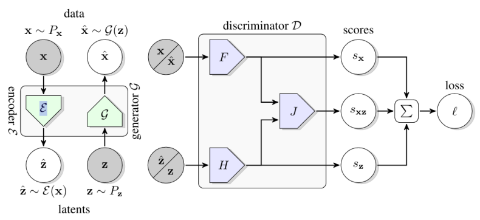
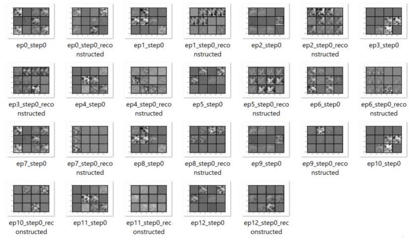
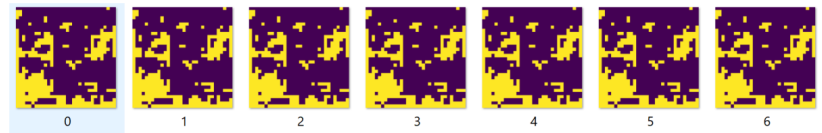
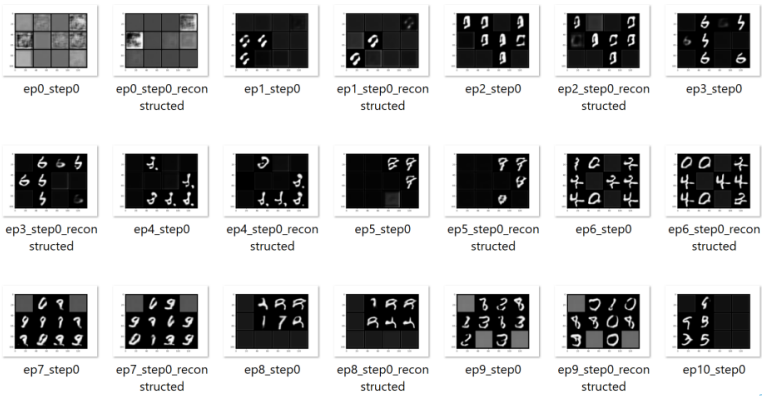
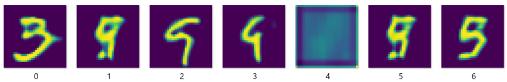
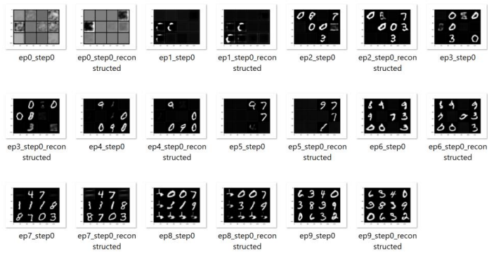
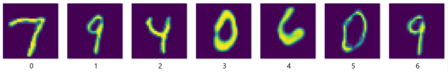
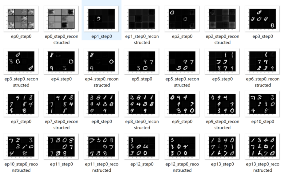
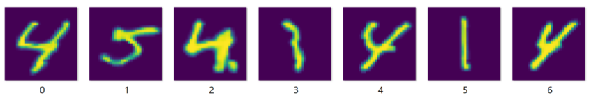
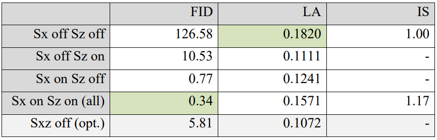

In the recent years, and after introducing the first Generative Adversarial Network, there has been many attempts at making the training of generative models more stable and their outputs more realistic. However, eventhough GAN produces better looking images than VAEs, it lags behind VAE in that it cannot encode real data (This is important because even when using Generative Models, our goal is often classification)
In [BiGAN](https://arxiv.org/abs/1605.09782) paper, an extra encoder was trained alongside the generator and the discriminator to allow data encoding. However, BiGAN is an old paper, and it does not have the innovations of recent GAN works. Later, in [BigBiGAN](https://arxiv.org/abs/1907.02544) paper, the architecture of [BigGAN](https://arxiv.org/abs/1809.11096) and the idea of BiGAN were combined so the results looked great in addition to the possiblity to encode data. 

In the first part of this project, I performed an in depth analysis of the elements present in BigBiGAN's loss function (See the figure below). 

I used the MNIST dataset and tried turning off each of the loss elements Sx, Sz, and Sxz, hence gaining an intuition on the effect of each one in the final performance.

12 epochs

### Sx off, Sz off
The learning is very unstable in this configuration. In some epochs, the generator loss would reach zero while the discriminator loss would reach around 40.

***Reconstructed images of each epoch:***

The model is producing random data throughout its learning.

***Random generated images from a batch:***

The images are at most different in a few pixels.
FID is 126.579 which is very large.
Linear Accuracy is 18.20%.

### Sx off, Sz on
The results are a little better in this configuration. However, Sx is the most important part of the loss, and without that we are telling the model that we don't care how similar should the generated image be to the original image, and its possible that we reach a reconstructed digit that is different than the original one!

***Reconstructed images of each epoch:***

***Random generated images from a batch:***

FID is 10.53 which is very better than the last configuration but still large.
Linear Accuracy is 11.11%.

### Sx on, Sz off

The results are again better than the last configuration. Note that in this configuration, matching the generated X with the real X is much more important than matching Z.

***Reconstructed images of each epoch:***

***Random generated images from a batch:***

FID is 0.777 which is very good.
Linear Accuracy is 12.41%.

### Sx on, Sz on
The results are better than all the previous configuration. Here we are using all elements of the BigBiGAN loss function.

***Reconstructed images of each epoch:***

***Random generated images from a batch:***

FID is 0.3373 which is the best among all configurations.
Linear Accuracy is 15.77%.
Inception Score is 1.165.

### Sx on, Sz on, Sxz off

In the previous configurations, Sxz was left untouched. Here I have analyzed what happens if we take out Sxz. It seems that the use of Sxz is not critical, but it affects the final performance.

***Reconstructed images of each epoch:***

***Random generated images from a batch:***

FID is 5.81.
Linear Accuracy is 10.72%.

---------------------------------------------------------------------
The table below summarizes the findings of these experiments:

