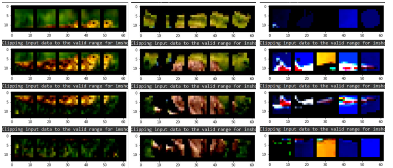
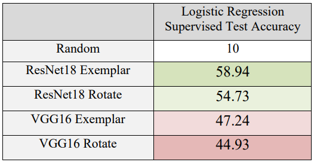

[Representation Learning with Contrastive Predictive Coding](https://arxiv.org/abs/1807.03748) is a method based on contrastive self-supervised learning that buffers the negative samples in the training, in order to yield more negative pairs in the self-supervised InfoNCE loss.

In this project I implement CPC once on ResNet18, and once on VGG16, using Rotation and Exemplar data augmentaions. Then I do linear classification on the learnt representations for evaluation.

In the figure below, after patchifying the images and augmenting the images, we can see from left to right the patches of an image for the supervised task, the patches in Rotate mode, and the patches in Exemplar mode:

Exemplar augmentation is defined as the combination of Translation, Scaling, Rotation, Inversion, Solarization, Contrast, Grayscale, and Color manipulations (increase SV, Increase H).

### Results
As the table suggests, ResNet is generally better than VGG16 and Exemplar augmentation is better than Rotation.

