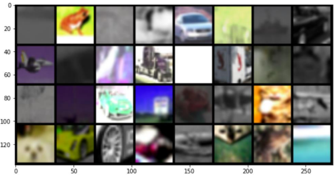
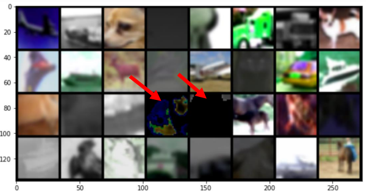
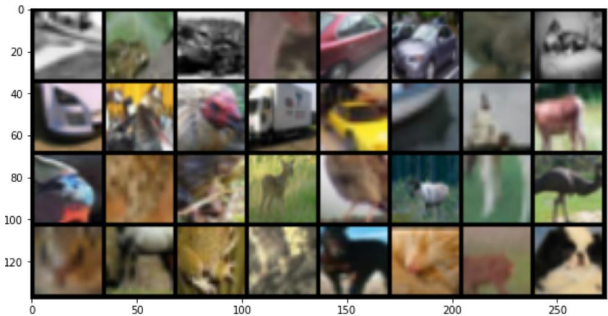
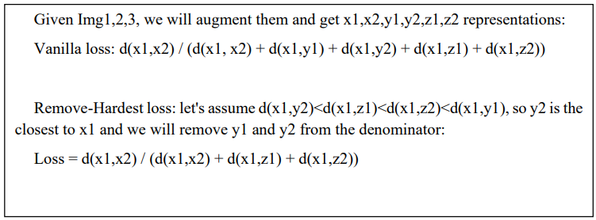
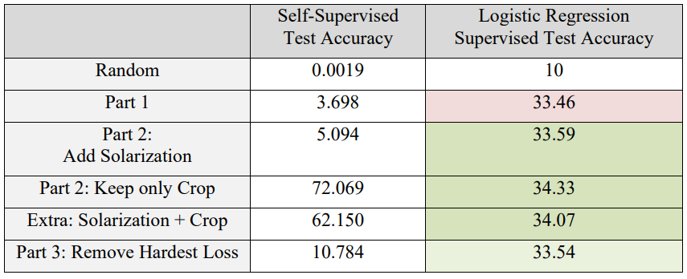

### Part 1

In this project I implemented the idea of SimCLR self-supervised learning on a ResNet18 and Cifar10 dataset.

***Configurations***:

The largest batch size I could work with was 512 in this project. The augmentations used are RandomResizedCrop, RandomHorizontalFlip, ColorJitter, RandomGrayscale, GaussianBlur. The figure below shows the first 16 images in a random batch after augmentation:

***Adding solarization augmentation***:

***Only keeping crop augmentation***:

***Modifying the loss function***:

I experimented with removing the hardest negative pairs from the loss, so that the model does not force them to get far from each other.
The figure below shows the new loss:

### Results and Discussion

The results are in the table below:

Choosing a correct Augmentation technique can help obtaining a better representation. However it is not that effective! Also removing the hardest negative pair results in worse performance. Because in self-supervised learning, the hard-negative pairs are crucial and important in achieving good results.
