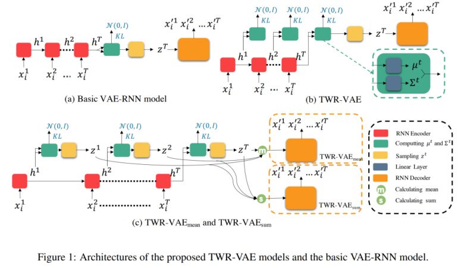

Timestep-Wise Regularization for VAE ((TWR-VAE)[https://arxiv.org/pdf/2011.01136.pdf]), presents a regularization method for mitigating the Posterior Collapse in vanilla VAE for text modelling. They present a VAE that additionally transforms some noise from previous time-steps to the decoder's input. 

In this project, I implement this architecture for 2 datasets, Yahoo (English) and DigiKala (Persian).

***Configurations due to computational limits***:
Embedding size was changed from 512 to 256, trained for 30 epochs only, learning rate was changed from 1e-4 to 1e-3, all sentences with more than 15 words were removed from the datasets.

***Evaluation on DigiKala***:

| ------------- | ------------- |
| Reconstruction loss | 35.2613  |
| KL loss  | 1.1558  |
| NLL loss  | 36.4171  |
| NLL loss per word  | 3.8583  |
| Perplexity  | 47.3866  |
| mi  | 4.0601  |

***Reconstruction of Digikala reviews:***
Despite the complexities of spoken Persian language, the model can reconstruct the sentences in an acceptable way. The model is also creating diverse sentences and is avoiding generic, obvious, and repeated reviews.

***Reconstruction of Yahoo reviews:***
The figure bellow shows that the reconstructed Persian sentences are as good as the English sentencs.

I need to train the model more for more beautiful results.
