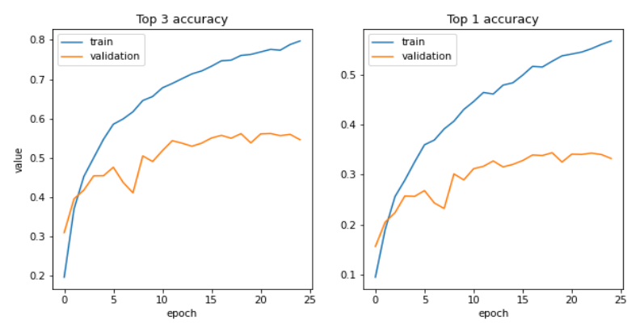
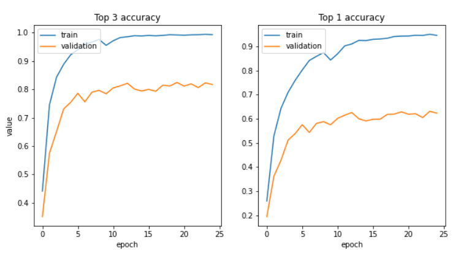

EfficientNet-B0 is a CNN from the [EfficientNet](https://arxiv.org/pdf/1905.11946.pdf) family. These models are created for image classification and differ in number of parameters. In this project, I take an EfficientNet-B0 pretrained on ImageNet and use it for classification on the [Stanford Cars dataset - car196](https://ai.stanford.edu/~jkrause/cars/car_dataset.html) dataset. I use the [NoisyStudent](https://keras.io/examples/vision/image_classification_efficientnet_fine_tuning/#using-the-latest-efficientnet-weights) model weights for better accuracy for the Transfer Learning. 
I perform transfer learrning in 3 steps to gain more intuition on how this knowledge transfer works.

### 1 - Finetuning by freezing all layers
In the first step, I freezed all layers but the last fully connected layers and trained the pretrained model on the new dataset.

As evident in the figure bellow, the top 1 accuracy on the test set is 0.33, and the top 3 accuracy is 0.55. The model has started overfitting after epoch 20.

### 2_1 - Further finetuning by unfreezing all layers
In this step, I took the model after step 1 and further finetuned the model. But this time I unfroze every layer and let the weights of all layers change.
(I used the best weights from step 1, and used a smaller learning rate)

As you can see in the figure bellow, the top 1 and top 3 test accuracies are respectively 0.68 and 0.87 which is remarkably higher than the first step.

### 2_2 - Further finetuning by unfreezing only the 6th and 7th convolutional blocks
In this step, similarily I took the model after step 1 and further finetuned the model. But this time by unfreezing only the 6th and 7th Conv blocks and freezing the rest of the network.

As you can see in the figure bellow, the top 1 and top 3 test accuracies are respectively 0.62 and 0.83 which is a little lower than ***step 2_1*** but still quite high.

### Conclusion

Unfreezing convolutional layers in the second step causes improvements. The representations, especially in the later convolutional layers are specific to the task and data the model was initially trained on. 
However the first convolutional layers are very generalizable, since they encode low level information that transfers well between different domains and tasks. For example, features representing edges and colors and even simple shapes are universal, and they don't change too much when we are going from the domain of objects to the domain of cars.
Also, if the computations do not fit on the GPU, without loosing too much accuracy, it is possible to only unfreeze the later convolutional layers when doing transfer learning, and skipping the gradient calculation for the first layers. 
