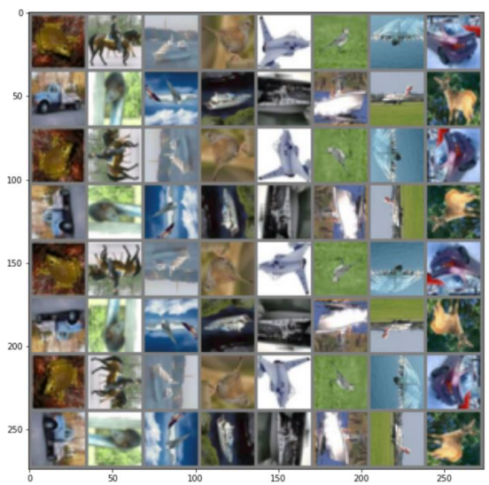
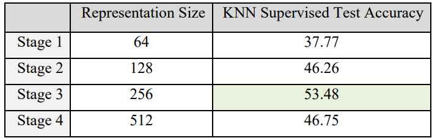
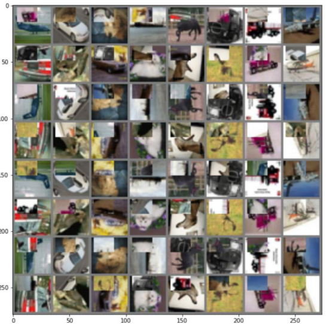
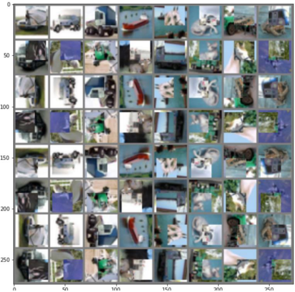
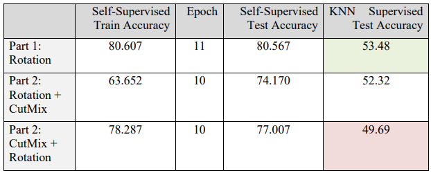
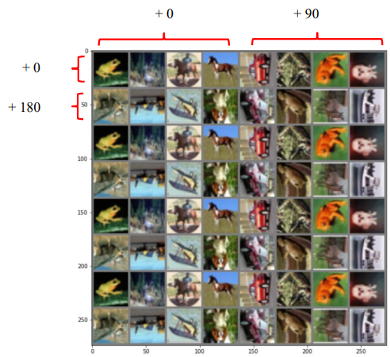
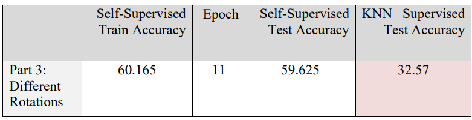

In this project, I obtained a useful representation by prediting rotations using ResNet18 and Cifar10 (Idea from this paper: [Unsuperivsed Representation Learning by Predicting Image Rotations](https://arxiv.org/abs/1803.07728)).

### Part 1

The figure below shows a random generated batch from the dataset. Each 2 row belongs to a specific rotation class ([0, 90, 180, 270] degrees).

I trained the model first. Then took the output representation of each ResNet18 stage (4 stages in total) and performed a KNN classification, to see which stage contains a more rich representation. The table below shows that the 3rd stage contains richer and more global information, and interestingly the Stage 4 representation is not as good as the stage 3.

### Part 2

I added CutMix data augmentation in this part by 2 methods and compared the performances.

***Cutmix then Rotation***

The figure below shows a generated batch by first applying Cutmix then Rotation.

***Rotation then Cutmix***

The figure below shows a generated batch by first applying Rotation then Cutmix.

The table below shows the results. Rotation then Cutmix is harder to learn, because the rotation of the mixed section does not follow the rotation of the rest of the image. Cutmix is a powerful augmentation method in supervised learning. But adding Cutmix reduced the accuracy in out self-supervised learning task.

### Part 3

In this part, instead of putting all possible rotations of each image in a batch, I used different images for each rotation in every batch.

The figure below shows a random generated batch in this setting:

The table below shows the results:

One difference between this method of batch creation with the previous parts is that the model might never see all rotations of a specific image, so it might not understand exactly what makes a model's label 0 and what makes another's 90. But when we had every rotation of every image, the model would be able to compare those and understand that it should focus on the rotation, not on the unrelevant parts of the image.
