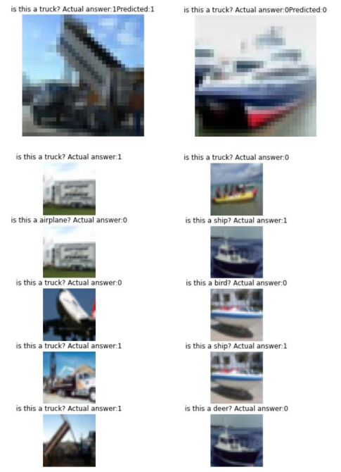

Visual Question Answering aims to answer textual questions from images. The aim of this project is getting more familiar with embeddings, and the logic behind visual question answering. 
In this project I create simple image-question pairs in the Cifar10 dataset and perform visual question answering on the created dataset.

### Dataset creation
The questions are very simple, they either ask ```Is this a [Object class existing in the image]``` or ```Is this a [Random object class not existing in the image]``` and the answers are YES and NO.
I created this dataset in this project and performed Visual Question Answering.

### Model
I used a fine-tuned VGG16 model to get the image embeddings. The image embedding accuracy for a pretext classification was 0.75 on the test dataset.
I used a simple network consisting of Embedding, LSTM, and Dense layers to get the textual embeddings of the questions. The accuracy of the embedding for a pretext classification task was 0.45 which is probably due to insignificant diversity in the questions. I would probably get a better embedding by using a simple Word2Vec model.
I concatenated the image and text embeddings and a fed the fused embedding to a KNN classifier for the task of Visual Question Answering. The final accuracy on asnwering the questions was 0.7969.

### Results
In the figure below, we can see the output of the network on 2 image-question pairs, and the 5 nearest neighbors to those image-text pairs at the bottom.


